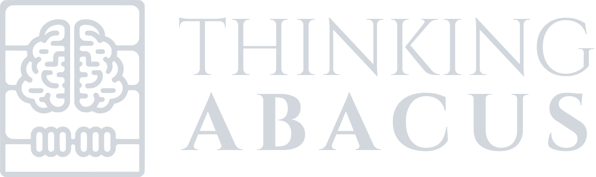

// set the picture side by side with the text

# THINKING ABACUS 

- bayesian reasoning toolset
- estimating priors
- elicit & perplexity api
- decision matrix UI
- Collective Decision Making tool

# THINKING ABACUS 
Augmented Epistemology

### Roadmap:
- bayesian reasoning toolset
- estimating priors
- elicit & perplexity api
- decision matrix UI
- Collective Decision Making tool
